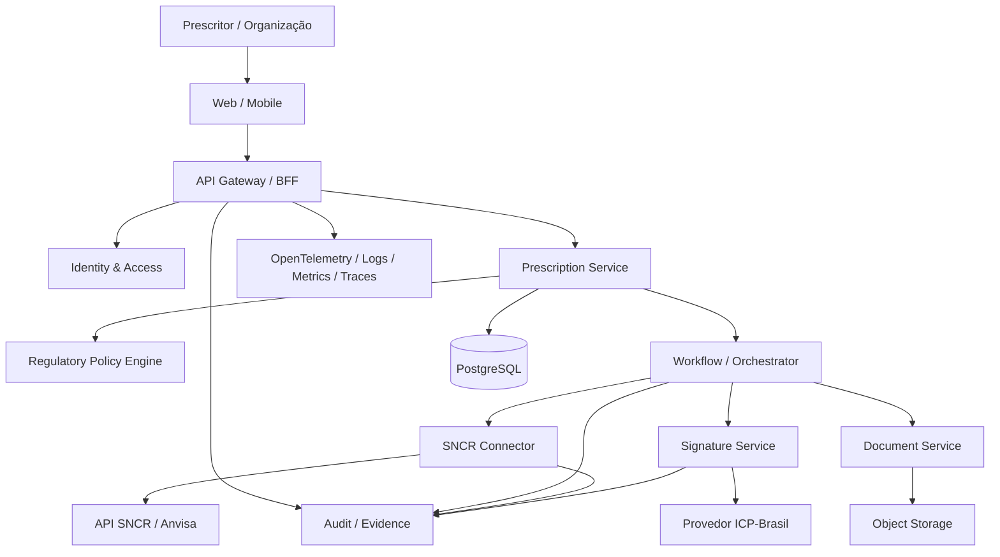

# SNCR — Plataforma própria de prescrição eletrônica integrada à Anvisa

Este repositório reúne a documentação de produto, requisitos, arquitetura, segurança, integração e plano de implementação de uma **plataforma própria de prescrição eletrônica integrada ao Sistema Nacional de Controle de Receituários (SNCR)**.

> **Decisão arquitetural:** este projeto será um sistema independente. O InteroperaX não será dependência operacional. Componentes, padrões e trechos maduros do `interoperax_workspace` poderão ser copiados e adaptados para acelerar a construção, preservando autonomia de código, deploy, banco, identidade, observabilidade e ciclo de vida.

## Objetivo

Construir uma solução própria capaz de atender profissionais e organizações de saúde e de consumir os serviços oficiais do SNCR para emissão e controle de receituários eletrônicos, com rastreabilidade, segurança, LGPD, assinatura digital e governança desde a origem.

A arquitetura deve permitir dois produtos sobre a mesma base:

1. **Plataforma SaaS de prescrição eletrônica** para médicos, odontólogos, veterinários, clínicas, hospitais e organizações de saúde.
2. **Health Regulatory Gateway / SNCR Gateway** para integração B2B com ERPs, prontuários, HIS, telemedicina e outras healthtechs.

## Princípios do projeto

- sistema próprio e independente;
- integração oficial com API do SNCR;
- domínio de saúde separado da infraestrutura reutilizada;
- segurança e LGPD by design;
- trilha de auditoria de todas as ações relevantes;
- idempotência em todas as operações externas críticas;
- regras regulatórias explícitas e versionadas;
- assinatura eletrônica compatível com a exigência aplicável ao tipo de receituário;
- modelos eletrônicos oficiais da Anvisa sem customização indevida;
- suporte a múltiplos tenants, organizações e prescritores;
- observabilidade ponta a ponta;
- nenhuma decisão clínica autônoma por IA.

## Estrutura da documentação

| Documento | Conteúdo |
|---|---|
| [`docs/01-visao-produto.md`](docs/01-visao-produto.md) | visão, escopo, atores, proposta de produto e fronteiras |
| [`docs/02-regulatorio-e-conformidade.md`](docs/02-regulatorio-e-conformidade.md) | base regulatória, SNCR x SNGPC, receituários e obrigações |
| [`docs/03-requisitos-funcionais.md`](docs/03-requisitos-funcionais.md) | requisitos funcionais e não funcionais |
| [`docs/04-arquitetura-tecnica.md`](docs/04-arquitetura-tecnica.md) | arquitetura alvo, serviços, C4 textual e infraestrutura |
| [`docs/05-integracao-api-sncr.md`](docs/05-integracao-api-sncr.md) | autenticação Gov.br, API, fluxos e estratégia de integração |
| [`docs/06-seguranca-lgpd-assinatura.md`](docs/06-seguranca-lgpd-assinatura.md) | segurança, LGPD, ICP-Brasil, segredos, auditoria e resposta a incidentes |
| [`docs/07-modelo-dados-e-workflows.md`](docs/07-modelo-dados-e-workflows.md) | entidades, estados, eventos, idempotência e workflows |
| [`docs/08-reuso-interoperax.md`](docs/08-reuso-interoperax.md) | inventário do que copiar/adaptar do InteroperaX e do que não reutilizar |
| [`docs/09-roadmap-mvp.md`](docs/09-roadmap-mvp.md) | fases, backlog, critérios de aceite e estratégia de entrega |
| [`docs/10-riscos-e-validacao.md`](docs/10-riscos-e-validacao.md) | riscos regulatórios/técnicos e plano de validação |
| [`docs/11-fontes-oficiais.md`](docs/11-fontes-oficiais.md) | fontes primárias da Anvisa e legislação a acompanhar |

## Contexto regulatório em 30/09/2026

A nova etapa eletrônica do SNCR entrou em disponibilidade em **30 de setembro de 2026**. A Anvisa informa que a adoção é gradual e não extingue a receita em papel. Sistemas privados de prescrição podem se integrar ao SNCR para utilizar os serviços necessários à emissão eletrônica dos receituários contemplados.

A documentação oficial informa ainda que:

- plataformas de prescrição eletrônica são público-alvo da integração;
- o credenciamento prévio da plataforma não é necessário no modelo documentado em julho/2026;
- o prescritor deve possuir inscrição ativa em conselho profissional suportado pelo SNCR e realizar o fluxo exigido para que seus dados estejam disponíveis na base;
- a autenticação de integração usa Gov.br por meio do fluxo exposto pela API SNCR;
- Notificações de Receita eletrônicas utilizam modelos oficiais definidos pela Anvisa;
- os modelos eletrônicos não podem ser customizados fora do padrão disponibilizado;
- o QR Code das Notificações de Receita deve apontar para a consulta pública do SNCR conforme padrão oficial;
- SNCR e SNGPC têm responsabilidades distintas e complementares.

## Arquitetura conceitual

## Decisão sobre InteroperaX

O InteroperaX será tratado como **acelerador de engenharia**, não como runtime do produto.

Serão avaliados para cópia/adaptação:

- estrutura de monorepo e serviços NestJS;
- autenticação/federação OIDC com Keycloak;
- propagação de `tenant_id` e isolamento por tenant;
- gateway/BFF e contratos OpenAPI;
- orquestração BullMQ, retry controlado, circuit breaker e DLQ;
- runtime de conectores HTTP;
- cofre/gestão de segredos por tenant;
- padrões de idempotência;
- evidence/audit trail;
- OpenTelemetry, correlation IDs, métricas e dashboards;
- Docker/Compose e padrões de CI.

Não serão copiados como núcleo do domínio:

- semântica/ontologias genéricas do InteroperaX;
- MCP/agent runtime;
- UI de Studio/pipelines;
- conectores não relacionados à saúde;
- regras de governança de IA que não se apliquem à prescrição.

## Stack alvo inicial

- **Frontend:** Next.js/React/TypeScript;
- **Backend:** NestJS/TypeScript;
- **Banco:** PostgreSQL;
- **ORM:** Prisma;
- **Filas:** Redis + BullMQ;
- **IAM interno:** Keycloak ou camada OIDC equivalente;
- **Integração SNCR:** REST HTTPS com Bearer JWT conforme fluxo oficial;
- **Assinatura:** provedor de assinatura remota ICP-Brasil para os casos exigidos;
- **Documentos:** geração fiel aos modelos oficiais + PDF + QR Code;
- **Storage:** S3-compatible com criptografia e políticas de retenção;
- **Observabilidade:** OpenTelemetry + collector + backend de traces/logs/métricas;
- **Deploy:** containers, ambientes separados `dev`, `training/homolog`, `prod`.

## Status

**Fase atual:** levantamento e arquitetura. Nenhuma implementação deve ser considerada validada para produção até concluir homologação técnica com o ambiente oficial aplicável, revisão jurídica/regulatória e testes de segurança.

## Referências oficiais principais

- Anvisa — SNCR: https://www.gov.br/anvisa/pt-br/assuntos/medicamentos/controlados/sncr
- Serviços de prescrição eletrônica: https://www.gov.br/anvisa/pt-br/assuntos/medicamentos/controlados/sncr/documentos-do-sncr
- Instruções de Integração API SNCR v1.0: https://www.gov.br/anvisa/pt-br/assuntos/medicamentos/controlados/sncr/documentos-do-sncr/instrucoes-de-integracao-api-sncr-v1-0.pdf
- Receituário eletrônico: https://www.gov.br/anvisa/pt-br/assuntos/medicamentos/controlados/sncr/receituario-eletronico
- RDC 1.000/2025 e materiais de perguntas e respostas: acompanhar pela página oficial do SNCR e pelo portal de legislação da Anvisa.

---

**Importante:** esta documentação é um blueprint técnico e de produto. Requisitos oficiais podem ser atualizados pela Anvisa; por isso a implementação deverá manter um processo de revisão regulatória contínua e versionar as regras aplicadas.