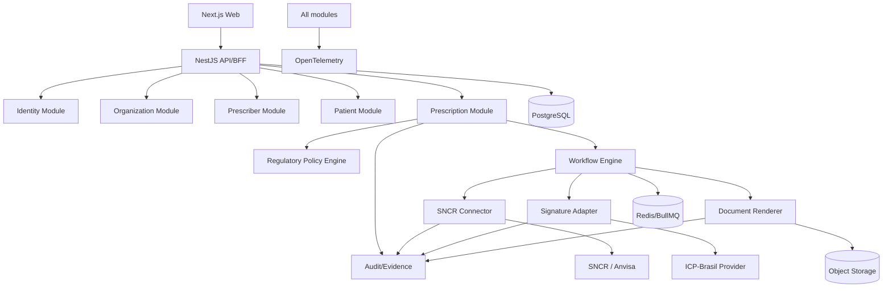

# 04 — Arquitetura Técnica

## 1. Princípio central

O sistema SNCR será **independente do InteroperaX**. O InteroperaX servirá somente como origem de padrões e componentes maduros que possam ser copiados/adaptados. Não haverá chamada obrigatória ao runtime do InteroperaX para emitir uma prescrição.

## 2. Estilo arquitetural

Para o MVP, recomenda-se um **modular monolith bem particionado + workers assíncronos**, evitando microserviços prematuros. Os limites de domínio devem, porém, ser explícitos para possibilitar extração futura.

### Motivo

- reduz complexidade operacional;
- facilita transações locais;
- acelera entrega;
- mantém observabilidade simples;
- ainda permite separar assinatura, documentos ou gateway no futuro.

## 3. Componentes lógicos



## 4. Módulos

### `identity`

Responsabilidades:

- usuários;
- sessões internas;
- RBAC/ABAC;
- MFA administrativo;
- service accounts;
- vínculo usuário ↔ tenant ↔ prescritor;
- integração OIDC do IAM interno.

Não deve misturar token interno com token SNCR.

### `organizations`

- tenant;
- unidades;
- configurações;
- vínculos;
- plano/limites no futuro;
- configuração de integração por ambiente.

### `prescribers`

- dados profissionais;
- conselho/UF/registro;
- elegibilidade SNCR;
- status de assinatura;
- vínculos organizacionais.

### `patients`

- dados mínimos necessários;
- identidade/deduplicação;
- políticas LGPD;
- histórico de consentimentos quando aplicável.

### `medication-registry`

- substâncias;
- medicamentos/apresentações;
- classificações;
- fonte e versão;
- relacionamento com regra regulatória.

### `regulatory-policy`

Deve ser determinístico e versionado.

Entradas:

- medicamento/substância;
- tipo de profissional;
- UF se relevante;
- contexto de prescrição;
- data/hora de referência;
- versão regulatória.

Saída exemplo:

```json
{
  "prescriptionType": "NR_B",
  "sncrRequired": true,
  "officialTemplate": "NR_B_ELECTRONIC_V2",
  "signaturePolicy": "QUALIFIED_ICP_BRASIL",
  "retention": true,
  "ruleSetVersion": "2026.09"
}
```

### `prescriptions`

Aggregate raiz da prescrição.

Responsável por:

- rascunho;
- validação;
- estados;
- itens;
- vínculo com regra;
- comandos de emissão;
- invariantes do domínio.

### `workflow`

Executa processo durável de emissão.

Sugestão de steps:

1. `validate-context`
2. `resolve-policy`
3. `validate-prescriber`
4. `ensure-sncr-session`
5. `acquire-or-reserve-number`
6. `render-document`
7. `request-signature`
8. `verify-signature`
9. `register/confirm-sncr`
10. `finalize-document`
11. `persist-evidence`
12. `notify`

Cada step deve ser idempotente.

### `connectors/sncr`

Um adapter exclusivo encapsula:

- base URL;
- autenticação;
- token;
- endpoints;
- DTOs;
- timeouts;
- tratamento de status HTTP;
- retry policy;
- correlation ID;
- métricas;
- versionamento da integração.

Nenhum outro módulo deve chamar a API SNCR diretamente.

### `signatures`

Abstração por provider:

```ts
interface SignatureProvider {
  createSignatureRequest(input): Promise<RequestRef>;
  getStatus(ref): Promise<SignatureStatus>;
  verify(document, signature): Promise<VerificationResult>;
}
```

Permite trocar provedor sem alterar o domínio.

### `documents`

- templates oficiais;
- renderização;
- QR Code;
- PDF;
- hash SHA-256;
- versionamento;
- armazenamento.

### `audit-evidence`

Eventos append-only lógicos:

- ator;
- tenant;
- resource;
- action;
- timestamp;
- correlation ID;
- rule version;
- external request reference;
- hashes;
- resultado.

## 5. Estrutura sugerida do repositório de código futuro

```text
sncr-platform/
├─ apps/
│  ├─ web/
│  ├─ api/
│  └─ worker/
├─ packages/
│  ├─ domain/
│  ├─ regulatory-policy/
│  ├─ sncr-client/
│  ├─ signature-client/
│  ├─ document-templates/
│  ├─ audit/
│  ├─ observability/
│  ├─ auth/
│  └─ shared/
├─ prisma/
├─ infra/
│  ├─ docker/
│  ├─ otel/
│  └─ keycloak/
├─ tests/
│  ├─ integration/
│  ├─ contract/
│  ├─ e2e/
│  └─ security/
└─ docs/
```

O repositório atual `SNCR` pode permanecer como documentação até a decisão de manter documentação e código juntos ou separados.

## 6. Multi-tenancy

Recomendação inicial:

- banco compartilhado;
- todas as tabelas operacionais com `tenant_id`;
- RLS no PostgreSQL para tabelas sensíveis;
- contexto de tenant derivado da identidade, nunca de header arbitrário do cliente;
- tarefas BullMQ carregam `tenant_id` assinado/validado;
- storage usa prefixo/bucket policy por tenant;
- secrets associados por tenant.

### Regra

Uma consulta sem tenant no domínio operacional deve ser considerada defeito de segurança.

## 7. Persistência

PostgreSQL como fonte transacional.

Características:

- UUID/ULID para IDs internos;
- `created_at`, `updated_at` em UTC;
- optimistic locking onde útil;
- unique constraints para external IDs/idempotency;
- transações explícitas em reserva de numeração;
- audit log separado dos logs de aplicação.

## 8. Filas e jobs

Redis + BullMQ para:

- workflows;
- assinatura assíncrona;
- webhooks;
- reconciliação;
- geração de documentos pesada;
- notificações.

### Princípios

- retries com backoff;
- número máximo de tentativas;
- DLQ persistente;
- retry manual auditável;
- job id determinístico quando possível;
- nunca repetir comando não idempotente sem chave/checagem.

## 9. Consistência com sistemas externos

Evitar transação distribuída. Usar saga/workflow durável.

Exemplo:

```text
LOCAL VALIDATED
  -> SNCR NUMBER RESERVED
  -> DOCUMENT GENERATED
  -> SIGNED
  -> SNCR CONFIRMED
  -> LOCAL ISSUED
```

Se uma etapa falhar, registrar estado intermediário e reconciliar. Nunca “voltar” silenciosamente o banco para `DRAFT` quando o SNCR já tiver produzido efeito externo.

## 10. API externa

Padrão:

- REST JSON;
- OpenAPI 3.x;
- versionamento `/api/v1`;
- Problem Details (`application/problem+json`) ou envelope consistente;
- `Idempotency-Key` nos POST críticos;
- `X-Correlation-Id` gerado/propagado;
- pagination cursor-based para grandes listas;
- rate limits por cliente/tenant.

## 11. Webhooks

Envelope sugerido:

```json
{
  "id": "evt_...",
  "type": "prescription.issued",
  "createdAt": "2026-09-30T20:00:00Z",
  "tenantId": "...",
  "data": {"prescriptionId": "..."}
}
```

Headers:

- event ID;
- timestamp;
- HMAC signature;
- versão.

Entrega at-least-once; consumidor deve deduplicar pelo event ID.

## 12. Observabilidade

Instrumentar:

- HTTP server/client;
- Prisma/Postgres;
- Redis/BullMQ;
- chamadas SNCR;
- assinatura;
- renderização;
- webhooks.

Atributos úteis:

- `tenant.id` (não segredo);
- `prescription.id`;
- `workflow.id`;
- `external.system=sncr`;
- `rule.version`;
- `document.template.version`.

Não anexar nome do paciente, CPF, medicamento completo ou token aos spans por padrão.

## 13. Ambientes

### Local
Mocks e simuladores. Nenhum dado real.

### Dev
Integrações simuladas ou treinamento.

### Training/Homolog
Ambiente oficial de treinamento do SNCR quando aplicável, dados de teste.

### Production
Segredos exclusivos, acesso restrito, aprovação de change, backups e alertas.

Configuração deve ser feita por environment variables/secrets manager, não branches de código.

## 14. Deploy

Base sugerida:

- Docker images imutáveis;
- migrations como etapa controlada;
- health/readiness checks;
- rollback de aplicação sem rollback destrutivo de schema;
- infra declarativa;
- release versionada.

## 15. Escalabilidade futura

Primeiros candidatos a extração para serviço independente:

1. `signature-service`;
2. `document-service`;
3. `sncr-gateway`;
4. `audit/evidence`;
5. `webhook-delivery`.

Não extrair antes de existir necessidade de escala, segurança ou autonomia operacional.