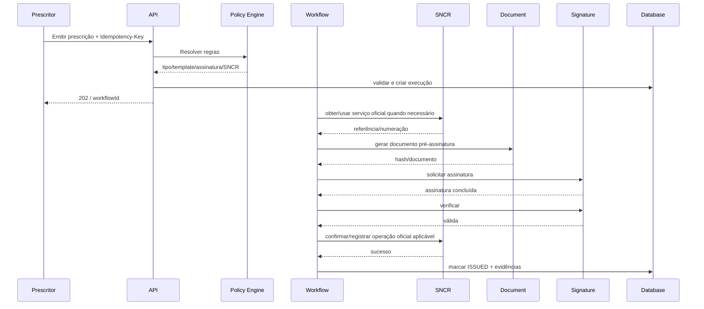

# 07 — Modelo de Dados e Workflows

## 1. Objetivo

Definir uma base de domínio própria para o sistema SNCR, preservando independência do InteroperaX e deixando explícitos os estados críticos para emissão, assinatura, integração oficial e auditoria.

## 2. Entidades principais

### Tenant

```text
Tenant
- id
- legal_name
- trade_name
- document_number
- status
- created_at
- updated_at
```

### OrganizationUnit

```text
OrganizationUnit
- id
- tenant_id
- name
- document_number
- address
- status
```

### User

```text
User
- id
- identity_provider_id
- name
- email
- status
```

### Membership

```text
Membership
- id
- tenant_id
- user_id
- role
- unit_id?
- status
```

### Prescriber

```text
Prescriber
- id
- user_id
- cpf_encrypted/index_tokenized
- council_type
- council_number
- council_state
- sncr_status
- sncr_status_checked_at
- signature_status
```

### Patient

```text
Patient
- id
- tenant_id
- identifiers
- name
- birth_date
- contact
- status
```

Dados reais e índices devem seguir minimização e estratégia de criptografia/tokenização.

### Medication / Substance

```text
Substance
- id
- canonical_name
- regulatory_list
- source_version
- valid_from
- valid_to

Medication
- id
- substance_id(s)
- name
- presentation
- registry_reference?
- source_version
```

### RegulatoryRule

```text
RegulatoryRule
- id
- rule_code
- version
- effective_from
- effective_to
- source_reference
- condition_json
- effect_json
- status
```

### Prescription

```text
Prescription
- id
- tenant_id
- prescriber_id
- patient_id
- type
- status
- rule_set_version
- official_number?
- external_reference?
- template_version?
- document_id?
- issued_at?
- expires_at?
- created_at
- updated_at
- version
```

### PrescriptionItem

```text
PrescriptionItem
- id
- prescription_id
- medication_id/substance_id
- dose
- route
- frequency
- duration
- quantity
- instructions
- regulatory_snapshot
```

### NumberAllocation

```text
NumberAllocation
- id
- tenant_id
- prescriber_id
- external_number
- type
- status
- reserved_by_prescription_id?
- acquired_at
- reserved_at?
- consumed_at?
- external_metadata
```

### Document

```text
Document
- id
- tenant_id
- prescription_id
- object_key
- sha256
- mime_type
- template_id
- template_version
- qr_payload?
- status
```

### Signature

```text
Signature
- id
- prescription_id
- provider
- provider_transaction_id
- signature_policy
- signer_identity
- certificate_metadata
- document_hash_before
- document_hash_after
- verification_status
- signed_at
```

### WorkflowExecution

```text
WorkflowExecution
- id
- tenant_id
- prescription_id
- type
- status
- current_step
- attempt
- correlation_id
- started_at
- completed_at?
```

### ExternalOperation

```text
ExternalOperation
- id
- tenant_id
- prescription_id
- system
- operation
- idempotency_key
- request_hash
- status
- external_reference?
- first_attempt_at
- last_attempt_at
- result_classification
```

### AuditEvent

```text
AuditEvent
- id
- tenant_id
- actor_type
- actor_id
- action
- resource_type
- resource_id
- correlation_id
- event_time
- metadata_minimized
- integrity_hash?
```

## 3. Máquina de estados da prescrição

Estados sugeridos:

```text
DRAFT
VALIDATING
VALIDATION_FAILED
READY_TO_ISSUE
NUMBER_PENDING
NUMBER_RESERVED
DOCUMENT_PREPARED
SIGNATURE_PENDING
SIGNED
SNCR_CONFIRMATION_PENDING
ISSUED
DELIVERY_PENDING
DELIVERED
CANCEL_PENDING
CANCELLED
EXPIRED
FAILED
MANUAL_REVIEW
RECONCILIATION_REQUIRED
```

### Regra

Nem todos os tipos de receita passarão obrigatoriamente por todos os estados. O workflow é parametrizado pela policy regulatória.

## 4. Transições críticas

### `DRAFT -> READY_TO_ISSUE`

Somente após:

- campos obrigatórios;
- profissional elegível;
- paciente válido;
- medicamentos classificados;
- policy engine executado;
- template e assinatura determinados.

### `READY_TO_ISSUE -> NUMBER_RESERVED`

Quando o tipo exige numeração oficial.

Garantias:

- operação transacional;
- número único;
- lock;
- evidência externa.

### `DOCUMENT_PREPARED -> SIGNED`

Somente após validação criptográfica da assinatura exigida.

### `SIGNED -> ISSUED`

Somente depois de todos os efeitos oficiais obrigatórios concluídos/confirmados.

Nunca marcar `ISSUED` apenas porque um PDF foi gerado.

## 5. Workflow de emissão



## 6. Idempotência

### Endpoint

```http
POST /api/v1/prescriptions/{id}/issue
Idempotency-Key: <uuid>
```

### Algoritmo

1. normalizar comando;
2. calcular `payload_hash`;
3. procurar chave no escopo tenant+operação;
4. se não existir, inserir com unique constraint;
5. se existir com mesmo hash, retornar resultado corrente/anterior;
6. se existir com hash diferente, `409`;
7. worker usa o mesmo identificador em chamadas que suportem idempotência.

## 7. Concorrência

Casos a testar:

- dois cliques em “Emitir”;
- duas abas;
- retry do frontend;
- retry do proxy;
- dois workers pegando o mesmo job;
- timeout após efeito externo;
- callback duplicado da assinatura.

Ferramentas:

- unique constraints;
- advisory locks ou `SELECT ... FOR UPDATE` quando necessário;
- optimistic locking (`version`);
- job IDs determinísticos;
- state transition compare-and-set.

## 8. Outbox pattern

Eventos externos/webhooks não devem ser publicados dentro de lógica frágil pós-commit.

```text
Transaction:
  update prescription
  insert audit event
  insert outbox event
COMMIT

worker:
  publish webhook/event
  mark outbox delivered
```

## 9. Inbox pattern

Callbacks de assinatura e outros eventos externos devem ter deduplicação:

```text
provider_event_id UNIQUE
payload_hash
received_at
processed_at
status
```

## 10. Evidência por prescrição

Criar uma visão/pacote lógico:

```text
Prescription Evidence Package
├─ prescription snapshot
├─ policy decision
├─ source/rule versions
├─ number allocation evidence
├─ document hash + template version
├─ signature evidence
├─ SNCR external references
├─ workflow timeline
└─ audit events
```

Esse pacote é fundamental para suporte, auditoria e investigação.

## 11. Histórico regulatório

Nunca recalcular o passado com a regra atual.

Ao emitir, persistir snapshot de:

- classificação;
- tipo de receituário;
- assinatura exigida;
- versão de regra;
- versão de template;
- campos regulatórios relevantes.

## 12. Soft delete

Evitar `DELETE` físico em entidades regulatórias críticas.

Usar status/`deleted_at` somente quando compatível e garantir que registros históricos permaneçam referenciáveis.

## 13. PII e busca

Não indexar CPF em claro. Estratégias possíveis:

- campo criptografado para recuperação autorizada;
- blind index/HMAC para busca exata;
- mascaramento por padrão.

## 14. Storage de documentos

Object key não deve conter CPF/nome.

Exemplo:

```text
tenants/{tenant_uuid}/prescriptions/{rx_uuid}/{document_uuid}.pdf
```

Metadados no banco; bucket privado; acesso por backend ou signed URL curta e auditada.

## 15. Integridade

Para documentos/evidências:

- SHA-256;
- hash guardado em banco;
- validar hash no download/uso sensível quando aplicável;
- opcionalmente encadear eventos de auditoria no futuro para detectar adulteração.

## 16. Reconciliação de estados

Worker pesquisa registros:

- `NUMBER_PENDING` antigo;
- `SIGNATURE_PENDING` expirado;
- `SNCR_CONFIRMATION_PENDING`;
- `RECONCILIATION_REQUIRED`;
- external operations `UNKNOWN_RESULT`.

Cada categoria possui runbook específico.

## 17. DLQ

Quando workflow exceder tentativas:

```text
DeadLetter
- workflow_id
- prescription_id
- failed_step
- error_code
- retry_count
- first_failure_at
- last_failure_at
- resolution_status
- resolved_by
- resolved_at
```

Retry manual precisa ser autorizado e auditado.

## 18. Eventos de domínio sugeridos

- `tenant.created`
- `prescriber.linked`
- `prescriber.sncr_eligible`
- `prescription.created`
- `prescription.validated`
- `prescription.number_reserved`
- `prescription.signature_requested`
- `prescription.signed`
- `prescription.issued`
- `prescription.failed`
- `prescription.reconciliation_required`
- `prescription.cancelled`

## 19. Modelo de consistência

Fonte de verdade:

- domínio local para estados internos;
- SNCR para efeitos oficiais/identificadores sob responsabilidade dele;
- provedor de assinatura para status de sua transação, verificado localmente;
- documento final armazenado por nós com hash/evidência.

Divergência nunca deve ser escondida. Ela vira estado explícito e tarefa de reconciliação.